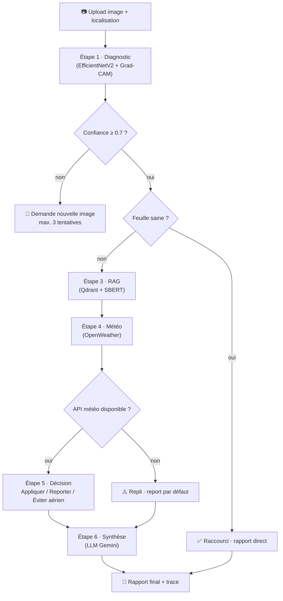
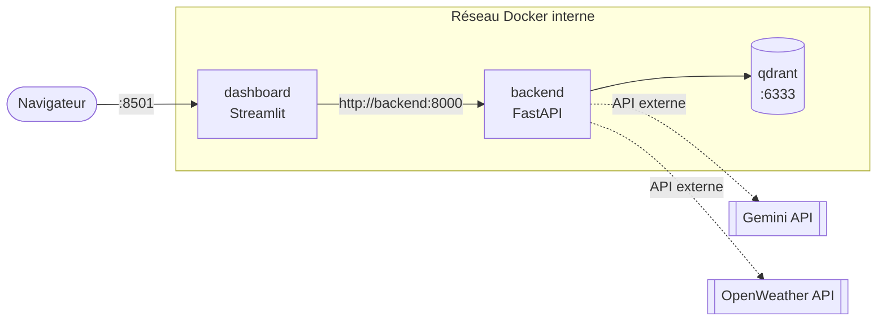

# 🌿 CassavaCare-Agent

**Système multimodal de diagnostic des maladies du manioc, basé sur la vision par ordinateur, le RAG et un agent IA explicable**


> Projet de Fin d'Études (PFE) — Diplôme national d'ingénieur en Sciences Appliquées et Technologies, spécialité **Data Science**, réalisé chez **[Ulytech](https://ulytechai.com)**.

---

## 📋 Table des matières

- [Contexte et problématique](#-contexte-et-problématique)
- [Aperçu de la solution](#-aperçu-de-la-solution)
- [Architecture](#️-architecture)
- [Fonctionnalités](#-fonctionnalités)
- [Stack technologique](#-stack-technologique)
- [Structure du projet](#-structure-du-projet)
- [Prérequis](#-prérequis)
- [Démarrage rapide](#-démarrage-rapide)
- [Configuration](#️-configuration)
- [Utilisation](#-utilisation)
- [Référence API](#-référence-api)
- [Fonctionnement du pipeline agentique](#-fonctionnement-du-pipeline-agentique)
- [Résultats et performance](#-résultats-et-performance)
- [Limites connues](#️-limites-connues)
- [Perspectives](#-perspectives)
- [Validation et tests](#-validation-et-tests)
- [Documentation complémentaire](#-documentation-complémentaire)
- [Auteur et encadrement](#-auteur-et-encadrement)
- [Licence](#-licence)

---

## 🎯 Contexte et problématique

Le manioc (*Manihot esculenta*) nourrit plus de **500 millions de personnes** dans le monde et constitue, en Afrique subsaharienne, la deuxième source de glucides après le maïs. Cette culture reste pourtant très vulnérable : la mosaïque du manioc (CMD), la striure brune (CBSD), la bactériose (CBB) ou encore la maladie des taches vertes (CGM) peuvent réduire le rendement de **jusqu'à 40 %**.

Sur le terrain, le diagnostic reste difficile :
- les tests de laboratoire (ELISA, PCR) sont fiables mais **coûteux et lents** ;
- les applications grand public existantes (Plantix, Agrio) fonctionnent comme des **boîtes noires**, ne sont pas spécialisées manioc, et **ignorent la météo locale**.

**CassavaCare-Agent** comble ce vide avec un agent agricole intelligent qui combine :

- 🔍 un modèle de **vision par ordinateur** (EfficientNetV2) pour classer la maladie à partir d'une photo de feuille ;
- 🔥 une **explicabilité visuelle** (Grad-CAM) pour justifier chaque décision ;
- 📚 un système **RAG** (Retrieval-Augmented Generation) adossé à une base documentaire agronomique (FAO, PubMed, IITA/CGIAR, Wikipédia) ;
- 🌦️ une **couche agentique conditionnelle** (LangGraph) qui adapte la recommandation à la météo locale.

L'objectif secondaire, tout aussi contraignant, est un **coût d'exploitation nul** (uniquement des ressources gratuites) et un **temps de réponse maîtrisé** (< 10 s sur GPU T4).

## 🖼️ Aperçu de la solution

Un agriculteur téléverse une photo de feuille et sa localisation dans le tableau de bord. En retour, il obtient :

1. le **diagnostic** (classe + score de confiance) ;
2. la **heatmap Grad-CAM** localisant les zones infectées ;
3. l'**arbre de raisonnement** de l'agent, étape par étape ;
4. les **sources documentaires** utilisées pour la recommandation ;
5. une **recommandation finale contextualisée** par la météo (appliquer / reporter / éviter la pulvérisation aérienne).

```text
Diagnostic : CMD (Mosaïque du manioc) — Confiance 87 %
Recommandation : Utiliser des variétés résistantes, éliminer les plants
   infectés, contrôler les aleurodes (vecteurs) — source : FAO Technical Report
Météo : Pluie prévue dans 6h (probabilité 65 %)
Décision : Appliquer dès maintenant la lutte antivectorielle
   (la pluie ne réduit pas l'efficacité de l'arrachage)
Zones infectées : carte thermique jointe
```

## 🏗️ Architecture

Le système est organisé en **trois couches** et **six modules fonctionnels** :

| Couche | Rôle | Technologies |
|---|---|---|
| **Interaction** | UI et communication client/serveur | Streamlit, FastAPI |
| **Orchestration** | Logique conditionnelle, décisions | LangGraph |
| **Exécution** | Traitements spécialisés | EfficientNetV2, Grad-CAM, Qdrant/SBERT, OpenWeather |



**Déploiement** — trois services orchestrés par Docker Compose :



## ✨ Fonctionnalités

| Exigence | Fonctionnalité |
|---|---|
| **FR1** | Ingestion d'images (JPG/PNG/JPEG) avec métadonnées de localisation |
| **FR2** | Diagnostic sur 5 classes (CBB, CBSD, CGM, CMD, Healthy) avec score de confiance et explicabilité Grad-CAM |
| **FR3** | Orchestration agentique conditionnelle (LangGraph) : porte de confiance, raccourci feuille saine, repli météo |
| **FR4** | Recherche sémantique (RAG) dans une base documentaire agronomique vectorisée (Qdrant + SBERT) |
| **FR5** | Contextualisation météo (pluie, vent) via OpenWeather pour ajuster la recommandation |
| **FR6** | Tableau de bord Streamlit à 5 onglets : Diagnostic, Grad-CAM, Raisonnement, Sources RAG, Recommandation |

## 🧰 Stack technologique

| Composant | Technologie | Rôle |
|---|---|---|
| Entraînement | Kaggle (GPU T4), PyTorch | Fine-tuning du modèle de classification |
| Classification | EfficientNetV2_s | Diagnostic visuel (5 classes) |
| Explicabilité | pytorch-grad-cam | Localisation des lésions |
| Embeddings | Sentence-BERT (`all-MiniLM-L6-v2`) | Vecteurs 384-d, similarité cosinus |
| Base vectorielle | Qdrant (Docker) | Indexation et recherche HNSW |
| Orchestration agentique | LangGraph | Graphe d'états conditionnel, traçabilité |
| LLM | Gemini (free tier) | Synthèse du rapport final |
| API météo | OpenWeather (free tier) | Prévisions pluie/vent 24h |
| Backend | FastAPI | API asynchrone (job + polling) |
| Frontend | Streamlit | Tableau de bord interactif |
| Conteneurisation | Docker Compose | Orchestration des 3 services |
| Versionnement | Git / GitHub | Gestion de code et reproductibilité |

## 📂 Structure du projet

```text
cassavacare_agent/
├── api/
│   ├── cache.py                   
│   ├── client.py               
│   ├── generator.py               
│   ├── main.py            
│   ├── models.py                  
│   ├── rag_service.py                 
│   ├── retriever.py  
│   ├── validation.py               
│   └── timing.py
├── artifacts/
├── config/
│   ├── config.yaml
├── src/                                    
│   ├── agent/
│   │   ├── config.py             
│   │   ├── prompts.py 
│   │   ├── graph.py             
│   │   ├── nodes.py 
│   │   ├── utils.py             
│   │   └── state.py  
│   ├── gradcam.py                    
│   ├── config.py                 
│   ├── inference.py               
│   ├── llm_client.py             
│   ├── model.py                 
│   ├── preprocess.py       
│   ├── utils.py
│   ├── weather_client.py           
│   └── api/
│       ├── main.py              
│       ├── jobs.py             
│       └── schemas.py          
├── dashboard/
│   ├── app.py                    
│   ├── config.py                 
│   ├── schemas.py               
│   ├── api_client.py             
│   ├── state.py                 
│   ├── reasoning_utils.py       
│   ├── requirements.txt 
│   ├── .dockerignore 
│   ├── components/
│        ├── results_placeholder.py                   
│        ├── sidebar.py   
│   ├── .streamlit/ 
│        ├── config.toml                 
│   └── Dockerfile
├── scripts/
│   └── e2e_validate.py         
├── data/                     
│   ├── ie2e_test_set/      
│   ├── processed/      
│   ├── raw /
│   ├── samples /
│   └── uploads/
├── documents/                     
│   ├── chunks/      
│   ├── cleaned/      
│   ├── raw /
│        ├── fao/                  
│        ├── iita/  
│        ├── pubmed/
│        └── wikipedia/
├── logs/ 
├── models/ 
│   └── best_model_scripted_efficientnetv2_s.pt
── notebooks/ 
│   └── efficient-cassava.ipynb
├── outputs/
├── reports/
│   └── e2e_run/
│       └── e2e_results.csv
├── scripts/
│   ├── chunk_documents.py                  
│   ├── clean_text_sources.py                 
│   ├── connection_test.py               
│   ├── create_collection.py             
│   ├── create_payload_index.py                  
│   ├── e2e_client.py                  
│   ├── e2e_validate.py      
│   ├── embed_and_index.py       
│   ├── evaluate_rag.py
│   ├── export_graph_diagram.py 
│   ├── eval_output/
│        ├── evaluation_results.json                  
│        ├── sevaluation_summary.csv
│        └── latex_tables.tex                 
│   ├── extract_pdfs.py                 
│   ├── fetch_wikipedia.py               
│   ├── generate_lates_tables.py             
│   ├── load_test.py                  
│   ├── run_agent_demo.py                  
│   ├── sample_test_images.py      
│   ├── snapshot.py       
│   ├── test_api.py
│   ├── test_search.py
│   ├── test_set.json                  
│   ├── validatechunks.py      
│   ├── validate decision_accuracy.py     
│   └── fetch_pubmed.py
├── tests/
│   ├── test_agent_graph.py                  
│   ├── test_agent_nodes.py                 
│   ├── test_agent_reliability.py               
│   ├── test_api.py             
│   ├── test_llm_client.py                  
│   ├── test_model.py                  
│   ├── test_sanity.py      
│   ├── test_weather_client.py 
├── validation/
├── .gdockerignore
├── .gitignore
├── .env
├── Dockerfile
├── docker-compose.yml        
├── requirements.txt
└── README.md
```

## ⚙️ Prérequis

- [Docker](https://docs.docker.com/get-docker/) et [Docker Compose](https://docs.docker.com/compose/)
- Python **3.11** (pour un développement hors conteneur)
- Une clé API **[Gemini](https://ai.google.dev/)** (offre gratuite)
- Une clé API **[OpenWeather](https://openweathermap.org/api)** (offre gratuite)

## 🚀 Démarrage rapide

```bash
# 1. Cloner le dépôt
git clone https://github.com/yacinebenkhrayef/cassavacare_agent.git
cd cassavacare_agent

# 2. Configurer les variables d'environnement
cp .env.example .env
# renseigner GEMINI_API_KEY et OPENWEATHER_API_KEY dans .env

# 3. Lancer la pile complète (Qdrant + backend + dashboard)
docker compose up --build
```

Une fois les trois services démarrés :

| Service | URL |
|---|---|
| 🖥️ Dashboard Streamlit | http://localhost:8501 |
| ⚙️ API FastAPI (docs Swagger) | http://localhost:8000/docs |
| 🗂️ Qdrant (interne au réseau Docker) | `qdrant:6333` |

> Le service `dashboard` attend que `backend` soit `service_healthy` avant de démarrer (`depends_on`).

### Exécution locale (sans Docker)

```bash
python -m venv venv && source venv/bin/activate
pip install -r requirements.txt

# Backend
uvicorn src.api.main:app --reload --port 8000

# Dashboard (dans un autre terminal)
export AGENT_API_BASE_URL=http://localhost:8000
streamlit run dashboard/app.py
```

## ⚙️ Configuration

Variables d'environnement principales (voir `.env.example`) :

| Variable | Défaut | Rôle |
|---|---|---|
| `GEMINI_API_KEY` | — | Clé API pour la synthèse du rapport (Gemini) |
| `OPENWEATHER_API_KEY` | — | Clé API pour les prévisions météo |
| `AGENT_API_BASE_URL` | `http://backend:8000` | Racine de l'API consommée par le dashboard |
| `REQUEST_TIMEOUT_S` | `15` | Délai maximal pour un appel HTTP unitaire |
| `POLL_INTERVAL_S` | `1.0` | Intervalle entre deux appels de polling |
| `POLL_TIMEOUT_S` | `25` | Plafond de sécurité du polling |
| `MAX_UPLOAD_MB` | `10` | Taille maximale d'image acceptée |

Seuils métier fixés dans l'agent :

| Règle | Seuil |
|---|---|
| Confiance minimale pour poursuivre le diagnostic | ≥ 0,70 |
| Probabilité de pluie → reporter le traitement | > 30 % |
| Vitesse du vent → éviter la pulvérisation aérienne | > 15 km/h |
| Tentatives max. en cas de faible confiance | 3 |

## 🖥️ Utilisation

1. Ouvrir le dashboard sur [http://localhost:8501](http://localhost:8501).
2. Téléverser une photo de feuille de manioc (JPG/PNG/JPEG) et renseigner la **localisation** (obligatoire, requise pour la vérification météo).
3. Lancer le diagnostic : le dashboard interroge `POST /diagnose`, puis effectue un *polling* jusqu'à complétion du job.
4. Explorer les **cinq onglets** du résultat :
   - **Diagnostic** — classe prédite et score de confiance ;
   - **Grad-CAM** — heatmap superposée à l'image, avec curseur d'opacité ;
   - **Raisonnement de l'agent** — trace étape par étape, sous forme de volets rétractables ;
   - **Sources RAG** — documents utilisés, avec score de pertinence ;
   - **Recommandation** — décision finale (appliquer / reporter / éviter aérien) et contexte météo.

> Selon le chemin emprunté par l'agent (confiance insuffisante, feuille saine ou feuille malade), certains onglets sont adaptés ou marqués comme non pertinents plutôt que laissés vides.

## 📡 Référence API

| Endpoint | Description | Réponse |
|---|---|---|
| `POST /diagnose` | Reçoit l'image (`File`) et la localisation (`Form`, obligatoire) ; lance le graphe LangGraph en tâche de fond | `202 Accepted` + `job_id` |
| `GET /diagnose/{job_id}` | État d'avancement du job | `JobStatusResponse` (`status`, `result`, `error`) |
| `GET /diagnose/{job_id}/gradcam` | Heatmap Grad-CAM d'un job terminé | PNG brut, ou `404` avec message explicite |

Exemple :

```bash
curl -X POST http://localhost:8000/diagnose \
  -F "image=@leaf.jpg" \
  -F "location=Kairouan, Tunisie"

# → {"job_id": "…", "status": "pending", "status_url": "/diagnose/…"}

curl http://localhost:8000/diagnose/<job_id>
```

L'état des jobs est conservé dans un `JobStore` en mémoire (thread-safe) — un choix assumé pour un prototype à coût nul, à remplacer par une solution persistante (Redis, base de données) en cas de passage en production.

## 🧠 Fonctionnement du pipeline agentique

L'agent est un `StateGraph` LangGraph composé de **six nœuds métier** et **deux nœuds de repli** :

1. **Diagnostic** — EfficientNetV2 + Grad-CAM → classe, confiance, heatmap.
2. **Porte de confiance** — si confiance < 0,7, redemande une image (3 tentatives max.).
3. **Récupération RAG** — recherche sémantique dans Qdrant à partir de la maladie prédite.
4. **Vérification météo** — interrogation OpenWeather, agrégation sur 24h (repli si API indisponible).
5. **Décision finale** — règles pluie/vent → *Appliquer* / *Reporter* / *Éviter aérien*.
6. **Synthèse** — génération du rapport par LLM (Gemini), avec repli sur un gabarit statique en cas d'échec.

Un raccourci dédié s'applique aux feuilles saines (rapport direct, sans RAG ni météo). Chaque nœud alimente une trace explicable, restituée telle quelle dans l'onglet *Raisonnement de l'agent* du dashboard.

## 📊 Résultats et performance

Bilan chiffré, confronté aux cibles du cahier des charges (§6) :

| Axe | Cible | Résultat obtenu | Statut |
|---|---|---|---|
| Accuracy (classification) | ≥ 88 % | 85,76 % | ⚠️ Non atteint |
| F1-score macro | ≥ 80 % | 0,7535 | ⚠️ Non atteint |
| Erreur par classe | < 15 % / classe | 1 classe sur 5 conforme (CMD) | ⚠️ Non atteint |
| Precision@3 (RAG) | ≥ 0,75 | 0,833 | ✅ Atteint |
| Recall@5 (RAG) | ≥ 0,80 | 1,000 | ✅ Atteint |
| Latence recherche Qdrant | < 500 ms | < 500 ms | ✅ Atteint |
| Fiabilité de l'agent | ≥ 85 % | 100 % (30/30) | ✅ Atteint |
| Temps de réponse perçu | < 10 s | 7,0 s en moyenne (5 scénarios) | ✅ Atteint (échantillon restreint) |
| Clarté des explications | Qualitatif | 4,0/5 en moyenne | 🟡 Globalement positif |

**À retenir** : le système RAG et l'orchestration agentique **dépassent nettement leurs cibles**. Le modèle de classification reste en retrait, en particulier sur les classes minoritaires (CBB, Healthy) pénalisées par le déséquilibre du jeu de données Kaggle (ratio 12,1× entre classe majoritaire et minoritaire). Le seuil de confiance de 0,7 joue le rôle de filet de sécurité côté produit face à cette limite du modèle.

## ⚠️ Limites connues

- **Dépendance à la connectivité Internet** (APIs météo et LLM) — bascule en mode dégradé si indisponible.
- **Quotas gratuits limités** (OpenWeather, Gemini), non taillés pour un déploiement à grande échelle (≥ 1000 requêtes/jour).
- **Sensibilité à la qualité d'image** — performances dégradées sur images floues, sous-exposées ou à arrière-plan complexe.
- **`JobStore` en mémoire** — l'état des jobs est perdu au redémarrage du service, pas de répartition de charge entre instances.
- **Validation terrain limitée** — jeu Kaggle public + ~30 images réelles collectées localement.
- **Pas de mémoire inter-diagnostics** — l'agent ne conserve pas l'historique d'une même parcelle.

## 🗺️ Perspectives

- Renforcer la classification sur les classes minoritaires (CBB, Healthy), explorer des backbones plus récents (ConvNeXt, Swin Transformer).
- Élargir les échantillons d'évaluation RAG et agent, avec une fenêtre météo plus variée pour observer les branches *apply* / *defer*.
- Réduire la dépendance à la latence du LLM externe (cache, streaming, modèle local léger).
- Remplacer le `JobStore` en mémoire par une solution persistante (Redis/BDD).
- Étendre le système à d'autres cultures vivrières et à une interface multilingue.

## 🧪 Validation et tests

```bash
# Validation scriptée de la fiabilité de l'agent (§6.3), sur la pile Docker complète
python scripts/e2e_validate.py
```

Ce script rejoue un échantillon stratifié de 30 images via l'API (et non en appelant directement le graphe en mémoire), et vérifie que chaque scénario attendu (confiance faible, feuille saine, décision météo-dépendante) aboutit à l'issue correspondante.

## 📚 Documentation complémentaire

Ce dépôt s'accompagne d'un rapport de Projet de Fin d'Études détaillant l'ensemble de la démarche (revue de littérature, conception, entraînement du modèle, évaluation RAG, agent LangGraph, intégration et résultats).

## 👤 Auteur et encadrement

- **Développé par** : Mohamed Yacine Ben Kharayef
- **Encadrante académique** : Mme Nouran Zouabi
- **Encadrant professionnel** : M. Safouene Kaiss ([Ulytech](https://ulytechai.com))
- **Année universitaire** : 2025–2026

## 📄 Licence

Projet réalisé dans le cadre d'un Projet de Fin d'Études académique. Usage académique et interne uniquement — aucune licence open source n'est attribuée à ce dépôt à ce stade.
